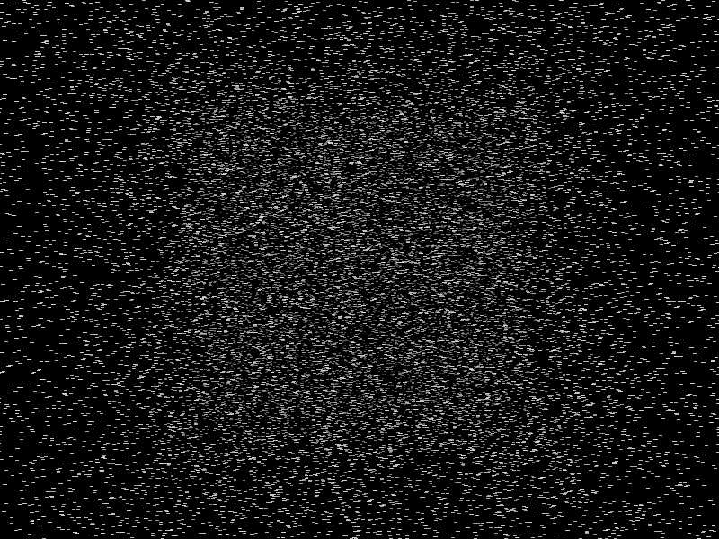



## VERY VERY POWERFUL 3D STARFIELD \!

### Description

# IMPORTANT - COMPILE THE PROGRAM BEFORE RUNNING #

This is a 3D starfield made using Win32 API but NO DIRECTX or other graphics DLLs. To give you some idea of the power, on my 400 Mhz PC it can render and animate 10000 stars at over 30 FPS! The # of stars is variable. The program is designed for pure speed and therefore does not have many features. This program is an example of

1/ Using pointers in VB

2/ Getting direct access to GDI graphics memory

3/ 3D to 2D transformations

4/ Fast manipulation of huge amounts of data (the stars coords)

I know there are lots of other starfields on PSC, but I dare to claim that this is the fastest! Please leave feedback and rate the code.
 
### More Info
 

             |
---                |---
**Submitted On**   |2001-04-24 23:20:00
**By**             |[Simon Price](https://github.com/Planet-Source-Code/PSCIndex/blob/master/ByAuthor/simon-price.md)
**Level**          |Advanced
**User Rating**    |5.0 (30 globes from 6 users)
**Compatibility**  |VB 6\.0
**Category**       |[Graphics](https://github.com/Planet-Source-Code/PSCIndex/blob/master/ByCategory/graphics__1-46.md)
**World**          |[Visual Basic](https://github.com/Planet-Source-Code/PSCIndex/blob/master/ByWorld/visual-basic.md)
**Archive File**   |[VERY VERY 187924242001\.zip](https://github.com/Planet-Source-Code/simon-price-very-very-powerful-3d-starfield__1-22669/archive/master.zip)

